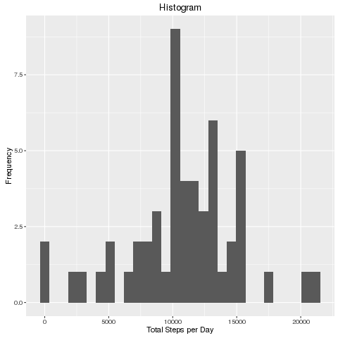
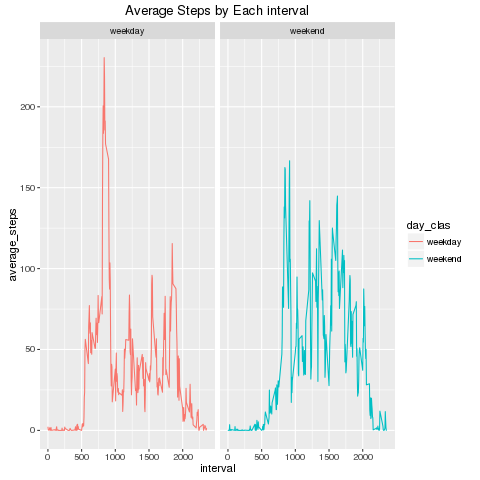

# Reproducible Research, Course Project 1.

## Loading and preprocessing the data

Fist we have to download and unzip a raw file, then transform from character data type to date data type for "date column", thus can get raw_data (dataframe)

```r
url = "https://github.com/GeodesiaSig/RepData_PeerAssessment1/blob/master/activity.zip?raw=true"
file = file.path(getwd(), "activity.zip")
download.file(url = url, destfile = file)
unzip(file)
raw_data <- read.csv(file = file.path(getwd(), "activity.csv"))
raw_data$date <- as.Date(raw_data$date, "%Y-%m-%d")
## preview of data
head(raw_data)
```

```
##   steps       date interval
## 1    NA 2012-10-01        0
## 2    NA 2012-10-01        5
## 3    NA 2012-10-01       10
## 4    NA 2012-10-01       15
## 5    NA 2012-10-01       20
## 6    NA 2012-10-01       25
```

## What is mean total number of steps taken per day?

For next steps it is mandatory have installed, then load dplyr and ggplot2 R packages. According to the instructions, we can ignore missing values in the dataset, first it should be removed NA's value and create a data frame grouped by date column to calculate total by each day.


```r
    library(dplyr)
    #Remove Rows with NA's value,Grouping by date and summarize(sum(steps))
    summary_day_steps <- raw_data[complete.cases(raw_data),] %>%
          group_by(date) %>% 
          summarize(total = sum(steps))
    head(summary_day_steps)
```

```
## Source: local data frame [6 x 2]
## 
##         date total
##       (date) (int)
## 1 2012-10-02   126
## 2 2012-10-03 11352
## 3 2012-10-04 12116
## 4 2012-10-05 13294
## 5 2012-10-06 15420
## 6 2012-10-07 11015
```


Let's see how total steps per day look on a histogram (its distribution).

```r
    library(ggplot2)
    # making a histogram (ht)
    png("plot_1.png")
    ht <- ggplot(data = summary_day_steps, aes(total))
    ht + labs(list(title = "Histogram", x = "Total Steps per Day", y = "Frequency")) +
    geom_histogram()
    dev.off()
```

```
## png 
##   2
```


The mean and median total per day, describes how the person's activity was in the last
58 days.


```r
    mean(summary_day_steps$total)
```

```
## [1] 10766.19
```

```r
    median(summary_day_steps$total)
```

```
## [1] 10765
```

## What is the average daily activity pattern?

Again, its necesary group data by column of interest and remove NA's value.
Let's look it.


```r
library(dplyr)
    #Remove Rows with NA's value,Grouping by interval and summarize(mean (steps))
    summary_interval <- raw_data[complete.cases(raw_data),] %>%
          group_by(interval) %>% 
          summarize(average_steps = mean(steps))
    head(summary_interval)   
```

```
## Source: local data frame [6 x 2]
## 
##   interval average_steps
##      (int)         (dbl)
## 1        0     1.7169811
## 2        5     0.3396226
## 3       10     0.1320755
## 4       15     0.1509434
## 5       20     0.0754717
## 6       25     2.0943396
```

A graphics from this time line, where data has been grouped by "interval" variable, can show us a pattern or some behavior.  


```r
    library(ggplot2)
    png("plot_2.png")
    st <- ggplot(summary_interval, aes(x = interval, y = average_steps))
    st + 
    labs(list(title = "Series Time Five-Minute Interval", x = "Five Minute Interval",
         y = "Steps' Average across all days")) +
    geom_path(colour = "orange")
    dev.off()
```

```
## png 
##   2
```
 

This graphics tell us that exists a continuos raise in the average of each interval between interval $750^{th}$ and $1000^{th}$ interval. Exactly the $835^{th}$ interval contains the maximum average across all days. Let's see next result.


```r
    filter(summary_interval, average_steps == max(average_steps))
```

```
## Source: local data frame [1 x 2]
## 
##   interval average_steps
##      (int)         (dbl)
## 1      835      206.1698
```

## Imputing missing values
In order to deal with the NA's value, and do some practical analysis, it is necessary fill them with an appropriate measure, this is the average of steps across all days by each interval (2304 rows have NA's value), that new data set will call p_data.


```r
    p_data <- raw_data
    # filling NA's value
    for(i in seq_along(summary_interval$interval)){
        for(j in seq_along(p_data$interval)){
            if(is.na(p_data$steps[j]) & 
               (p_data$interval[j] == summary_interval$interval[i])){
                p_data$steps[j] <- summary_interval$average_steps[i]
            }
        }
    }
    length(which(is.na(p_data$interval)))
```

```
## [1] 0
```

Last output show that with the code has already filled NA's value on the new data set.
Now is the median of steps


```r
    library(ggplot2)
    library(dplyr)
    total_p_data <- tbl_df(p_data)%>%
          group_by(date) %>% 
          summarize(total = sum(steps))
    head(total_p_data)
```

```
## Source: local data frame [6 x 2]
## 
##         date    total
##       (date)    (dbl)
## 1 2012-10-01 10766.19
## 2 2012-10-02   126.00
## 3 2012-10-03 11352.00
## 4 2012-10-04 12116.00
## 5 2012-10-05 13294.00
## 6 2012-10-06 15420.00
```

```r
    p_d <- ggplot(data = total_p_data, aes(x = total))
    png("plot_3.png")
    p_d + 
        labs(list(title = "Histogram Filled NA's", x = "Total Steps per Day", 
                       y = "Frequency")) +
        geom_histogram()
    dev.off()
```

```
## png 
##   2
```

```r
    mean(total_p_data$total)
```

```
## [1] 10766.19
```

```r
    median(total_p_data$total)
```

```
## [1] 10766.19
```
 

As we can see, the data set mantains its mean, but the first date appears now with a total steps equal to the total mean, like we want.

# Are there differences in activity patterns between weekdays and weekends?

Now, we look for a pattern in function of the days of week, classified in two categories: weekday and weekend. Let's classify.


```r
    ## Days of the week in Spanish language.
    weekday <- c("lunes","martes","miércoles","jueves","viernes")
    weekend <- c("sábado","domingo")
    p_data <- mutate(p_data, day_week = weekdays(date), day_clas = NULL)
    for(i in seq_along(p_data$day_week)){
        if(p_data$day_week[i] %in% weekday){
           p_data$day_clas[i] <- c("weekday") 
        }
       if(p_data$day_week[i] %in% weekend){
           p_data$day_clas[i] <- c("weekend") 
        } 
    }
    p_data$day_clas <- as.factor(p_data$day_clas)
    head(p_data)
```

```
##       steps       date interval day_week day_clas
## 1 1.7169811 2012-10-01        0    lunes  weekday
## 2 0.3396226 2012-10-01        5    lunes  weekday
## 3 0.1320755 2012-10-01       10    lunes  weekday
## 4 0.1509434 2012-10-01       15    lunes  weekday
## 5 0.0754717 2012-10-01       20    lunes  weekday
## 6 2.0943396 2012-10-01       25    lunes  weekday
```

Now data will be grouped by interval and day_class variables respectively, then summarized applying mean function to steps variable. Let's do it.


```r
    library(dplyr)
    w_data <- group_by(p_data, interval, day_clas) %>%
              summarize(average_steps = mean(steps))
    head(w_data)
```

```
## Source: local data frame [6 x 3]
## Groups: interval [3]
## 
##   interval day_clas average_steps
##      (int)   (fctr)         (dbl)
## 1        0  weekday    2.25115304
## 2        0  weekend    0.21462264
## 3        5  weekday    0.44528302
## 4        5  weekend    0.04245283
## 5       10  weekday    0.17316562
## 6       10  weekend    0.01650943
```


```r
    library(ggplot2)
    png("plot_4.png")
    st_w <- ggplot(data = w_data, aes(x = interval, 
                                      y = average_steps, colour = day_clas))
    
    st_w + geom_line() + facet_grid(facets = .~ day_clas)+
        labs(list(title = "Average Steps by Each interval", xlab = "Interval", 
                  ylab = "Average of Steps"))
    dev.off()
```

```
## png 
##   2
```

```r
    group_by(w_data, day_clas) %>% summarize(average = mean(average_steps), 
                                             median = median(average_steps))
```

```
## Source: local data frame [2 x 3]
## 
##   day_clas  average   median
##     (fctr)    (dbl)    (dbl)
## 1  weekday 35.61058 25.80314
## 2  weekend 42.36640 32.33962
```
 

The last two numbers describes the behavior in two separate categories, and confirm the tendency, weekends has majors values of steps than weekdays.


